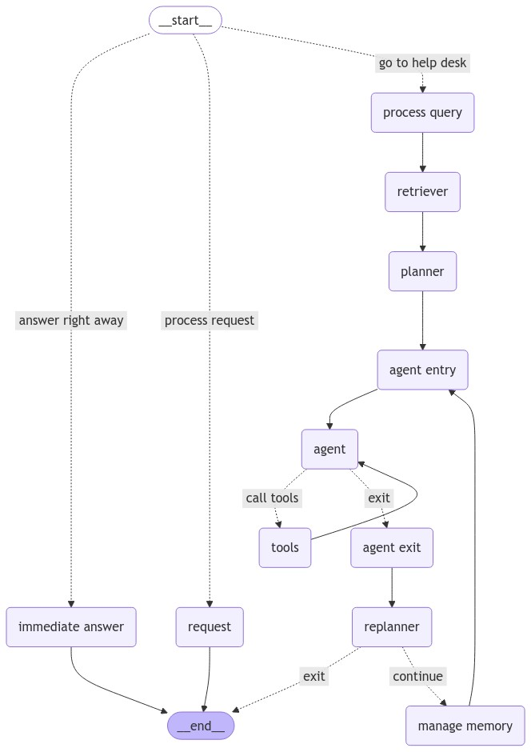

# Chatbot SMS

The chat app is a chainlit app that interacts with a user either through a twilio number or through a chainlit web interface.

The data ingestion is a streamlit app that takes a PDF or a DOCX file, chunks and embeds it and stores the embeddings in a MongoDB Atlas vector store.

Both apps share a great deal of common dependencies. The main difference is that the chat app uses chainlit while data ingestion uses streamlit because file uploading is handled much more cleanly on streamlit than chainlit.

## The RAG architecture

The chat app implements an algorithm introduced in Wang, L., Xu, W., Lan, Y., Hu, Z., Lan, Y., Lee, R. K. W., & Lim, E. P. (2023). Plan-and-solve prompting: Improving zero-shot chain-of-thought reasoning by large language models. arXiv preprint arXiv:2305.04091. [[PDF][1]] to generate an answer with high accuracy.

The current implementation is as follows:




## Prerequisite
1.  Python 3.11

## Setup
1.  Clone this repo
2.  Setup python and install deps
    ```shell
    python3.11 -m venv venv
    source ./venv/bin/activate
    pip install -r ./requirements.txt
    ```
3.  Copy `.env.example` to `.env` and replace with real values

## Running

### Chat app

To use the chat app, run the following command from the `./chatbot` directory.
```shell
chainlit run ./src/bot.py
```
To reach the API endpoints, use `/sms`:
```none
http://localhost:8000/sms
```
To get an answer back in a GET request, use `/answer/?question=YOUR-QUESTION`. An example:
```none
http://localhost:8000/answer/?question=what time is checkout?
```

### Data ingestion

To ingest data to use the RAG system in the chatbot, run the following command from the `./ingestion` directory.
```shell
streamlit run ./app.py
```


  [1]: https://arxiv.org/pdf/2305.04091
